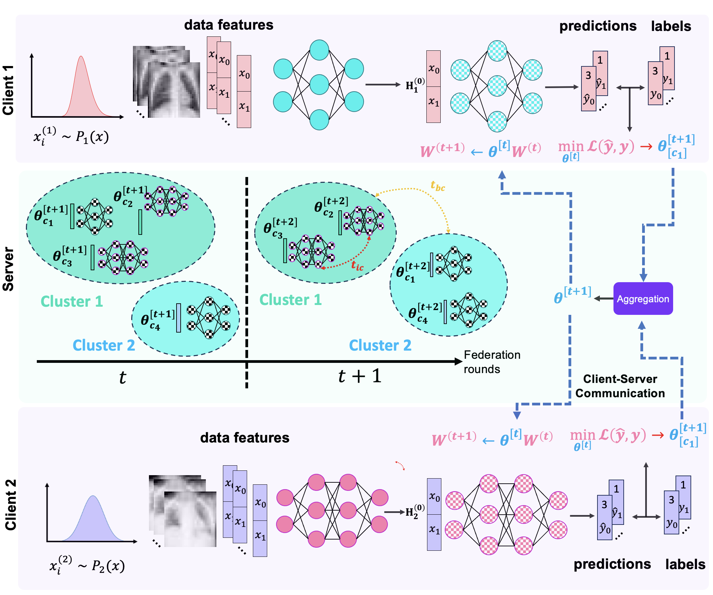

# UnifiedFL: A Dynamic Unified Federated Learning Framework for Equitable Healthcare AI

## Overview

UnifiedFL enables **federated learning across fully heterogeneous models** (CNNs, MLPs, U-Nets, etc.) and **non-IID datasets** by representing every local model as a **model-graph**.  
A single shared **graph neural network (GNN)** parameter vector governs updates across all clients, eliminating tensor-shape mismatches.  

UnifiedFL also introduces a **dynamic clustering mechanism**: after each communication round, clients are grouped by the Euclidean distance of their GNN parameters, enabling *similar clients to synchronize often* while *dissimilar clients exchange knowledge less frequently*.  
This balances convergence and diversity, improving generalization under severe domain shifts.

#### (Submitted to *Medical Image Analysis (MEDIA), 2025* — under review)

<!-- drop in your main figure -->



> **UnifiedFL: A Dynamic Unified Federated Learning Framework for Equitable Healthcare AI**  
>
> Furkan Pala and Islem Rekik  
> BASIRA Lab, Imperial-X and Department of Computing, Imperial College London, London, UK  
>
> **Abstract:** *Federated learning (FL) has transformed collaborative medical AI, but most approaches still assume either shared architectures or mild heterogeneity. UnifiedFL breaks this barrier by (i) representing heterogeneous local models as graphs updated through a shared GNN parameter vector, (ii) introducing distance-driven dynamic clustering to mitigate inter-client drift, and (iii) enforcing a two-tier aggregation policy balancing intra- and inter-cluster communication. Experiments on MedMNIST classification and Medical Decathlon segmentation benchmarks show UnifiedFL consistently outperforms strong baselines under both architecture and data heterogeneity. UnifiedFL lays the foundation for equitable, architecture-agnostic, and privacy-preserving healthcare AI.*


---

## Project Structure
```
unifiedfl/
├─ README.md
├─ pyproject.toml
├─ requirements.txt
├─ setup.cfg
├─ unifiedfl
│  ├─ __init__.py
│  ├─ utils
│  │  ├─ __init__.py
│  │  ├─ logging.py
│  │  ├─ seed.py
│  │  └─ misc.py
│  ├─ data
│  │  ├─ __init__.py
│  │  ├─ idxio.py
│  │  ├─ datasets.py
│  │  └─ loaders.py
│  ├─ models
│  │  ├─ __init__.py
│  │  ├─ mlp.py
│  │  ├─ cnn.py
│  │  └─ unifiedfl.py
│  ├─ graphs
│  │  ├─ __init__.py
│  │  ├─ convert.py
│  │  └─ unify.py
│  ├─ train
│  │  ├─ __init__.py
│  │  ├─ train_unifiedfl.py
│  │  └─ train_baseline.py
│  └─ eval
│     ├─ __init__.py
│     └─ evaluate.py
└─ scripts
   ├─ train_unifiedfl_ws.py
   ├─ train_baseline.py
   └─ test_unifiedfl.py
```

- `unifiedfl/models`: CNN/MLP baselines + unifiedfl variants (`unifiedfl`, `unifiedfl_WS`, `unifiedflModelSpecific`)
- `unifiedfl/graphs`: model→graph conversion (`convert.py`) and multi-model unification (`unify.py`)
- `unifiedfl/data`: MedMNIST/MorphoMNIST-style datasets, loaders, and IDX helpers
- `unifiedfl/train` / `unifiedfl/eval`: training loops and evaluation utilities
- `scripts/`: CLI entry points for training/testing

---

## Setup

### 1) Create and activate a virtual environment

```bash
python3 -m venv .venv
source .venv/bin/activate
```

### 2) Install dependencies
```bash
pip install -r requirements.txt
```

PyTorch Geometric has CUDA-specific wheels. If you need a specific CUDA build, install PyTorch first from https://pytorch.org/get-started/locally/ and then:
pip install torch-geometric

### 3) (Optional) Editable install

If you want to `import unifiedfl` anywhere:
```bash
pip install -e .
```
---

## Data

### MedMNIST (PathMNIST example)

The scripts will auto-download via `medmnist`. To create a **distribution shift** split used by unifiedfl (clusters), place your cluster index arrays here (or in the project root) as:
```
PathMNIST_cluster0.npy
PathMNIST_cluster1.npy
PathMNIST_cluster2.npy
```
Each `.npy` holds integer indices into the **train** split specifying which examples belong to a given cluster. Example shape: `(N_i,)`.

> You control how clusters are formed (e.g., k-means in feature space, pathology groups, random shards). The training script only needs these index files.

---

## Quick Start

### Baseline training (single model)

Train one of the baselines on the clustered training batches:
```bash
python scripts/train_baseline.py \
  --seed 42 \
  --batch-size 1024 \
  --epochs 200 \
  --model-idx 2 \
  --lr 0.05 \
  --outdir outputs
```
- `--model-idx` chooses which baseline architecture to train (as instantiated in the script):  
  - `0`: `CNNClassifierDeep(in_channels=3, num_classes=9)`  
  - `1`: `CNNClassifier(in_channels=3, num_classes=9)`  
  - `2`: `MLPClassifier(3*28*28, [100, 50, 20], 9)`

Artifacts:
- Weights → `outputs/baseline_model_{model-idx}.pt`
- Metrics JSON → `outputs/baseline_model_{model-idx}_metrics.json`

### unifiedfl (weight-sharing) training

Train the unified GNN that operates on the **disjoint union** of all model-graphs:
```bash
python scripts/train_unifiedfl_ws.py \
  --seed 42 \
  --batch-size 1024 \
  --epochs 200 \
  --dataset pathmnist \
  --num-clusters 3 \
  --lr 0.05 \
  --k-edge-theta 5000000 \
  --k-bias-theta 1000000 \
  --act softsign \
  --scale 1.5 \
  --outdir outputs
```
Artifacts:
- unifiedfl snapshot → `outputs/unifiedfl_ws.pt`
- Best-per-model graph states (edge_attr/bias buffers) →  
  `outputs/unifiedfl_ws_graph_{1,2,3}_best_f1.pt`
- Full training metrics → `outputs/unifiedfl_ws_metrics.json`

### Test the trained unifiedfl

Evaluate the unifiedfl on the test split:
```bash
python scripts/test_unifiedfl.py --weights outputs/unifiedfl_ws.pt
```
This prints per-model weighted precision/recall/F1 as JSON.

---

## What’s Happening Under the Hood?

- **Graphification** (`unifiedfl/graphs/convert.py`):  
  - **MLP**: Linear -> edges (weights), out neurons -> nodes (bias), ReLU flags.  
  - **CNN**: Conv kernels unrolled into edges indexed by `(layer, out_c, in_c, k_i, k_j)`.  
- **Unification** (`unifiedfl/graphs/unify.py`):  
  - Stitches multiple model-graphs into a single `torch_geometric.data.Data`.  
  - Keeps track of per-edge kernel IDs for **weight-sharing** grouping (`unifiedfl_WS`).  
- **unifiedfl forward** (`unifiedfl/models/unifiedfl.py`):  
  - Writes each model’s input activations into its input nodes.  
  - Runs message passing per-layer slice; applies learned θ groups to edges/biases.  
  - Reads off each model’s output nodes to compute per-model losses.

---

## Reproducibility

- Set seeds with `--seed` (default 42).  
- Determinism toggled in `unifiedfl/utils/seed.py`.  
- Batch shuffling seeds are passed to PyTorch `DataLoader`s.

---

## Typical Workflows

### A) Train a baseline, then unifiedfl

1) Prepare cluster files: `PathMNIST_cluster{0,1,2}.npy`  
2) Train a baseline model (e.g., MLP `model-idx=2`)  
3) Train unifiedfl with the same cluster files  
4) Test unifiedfl on the global test split

### B) Swap in your own models

- Add your architecture in `unifiedfl/models/`  
- Extend `unifiedfl/graphs/convert.py` to map it to a graph  
- Register in `scripts/train_unifiedfl_ws.py` model list

---

## Command Reference

```
scripts/train_baseline.py

--seed INT              # RNG seed
--batch-size INT        # batch size (default: 1024)
--epochs INT            # max epochs (default: 200)
--model-idx {0,1,2}     # which predefined baseline to train
--lr FLOAT              # learning rate (default: 0.05)
--outdir PATH           # output directory (default: outputs)
```

```
scripts/train_unifiedfl_ws.py

--seed INT
--batch-size INT
--epochs INT
--dataset {pathmnist}   # currently PathMNIST is wired
--num-clusters INT      # number of cluster index files
--lr FLOAT
--k-edge-theta INT      # number of θ groups for edges (weight-sharing)
--k-bias-theta INT      # number of θ groups for biases
--act {relu,softsign,scaled_tanh,scaled_softsign,...}
--scale FLOAT           # scale for scaled activations
--outdir PATH
```

```
scripts/test_unifiedfl.py

--weights PATH          # load unifiedfl state_dict (optional)
```

---

## Requirements

Install via:
pip install -r requirements.txt

Key libs:
- `torch`, `torchvision`, `torch-geometric`
- `medmnist`, `numpy`, `tqdm`, `scikit-learn`, `matplotlib`, `networkx`

> GPU strongly recommended for unifiedfl_WS, especially with large `k_edge_theta`.

---

## Troubleshooting

- **“No module named torch_geometric”**  
  Install PyTorch first (CUDA-matched), then `pip install torch-geometric`.

- **OOM during unifiedfl training**  
  Reduce `--batch-size`, or lower `--k-edge-theta` / `--k-bias-theta`.

- **Cluster file not found**  
  Ensure `PathMNIST_cluster{0..K-1}.npy` exist and index into the **train** set.

- **Metrics look frozen**  
  Try a smaller LR (`--lr 0.005`) or use `relu` activation in the unifiedfl.

---

## Citation

If this repository is useful in your research, please cite:
```
@article{pala2025unifiedfl,
  title={UnifiedFL: A Dynamic Unified Federated Learning Framework for Equitable Healthcare AI},
  author={Furkan Pala and Islem Rekik},
  journal={Submitted to Medical Image Analysis (MEDIA)},
  year={2025},
  note={Under review}
}
```
